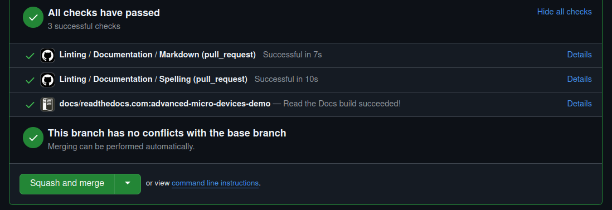

# Building documentation

## GitHub

If you open a pull request and scroll down to the summary panel,
there is a commit status section. Next to the line
`docs/readthedocs.com:advanced-micro-devices-demo`, there is a `Details` link.
If you click this, it takes you to the Read the Docs build for your pull request.



If you don't see this line, click `Show all checks` to get an itemized view.

## Command line

You can build our documentation via the command line using Python.

See the `build.tools.python` setting in the [Read the Docs configuration file](https://github.com/ROCm/ROCm/blob/develop/.readthedocs.yaml) for the Python version used by Read the Docs to build documentation.

See the [Python requirements file](https://github.com/ROCm/ROCm/blob/develop/docs/sphinx/requirements.txt) for Python packages needed to build the documentation.

Use the Python Virtual Environment (`venv`) and run the following commands from the project root:

```sh
python3 -mvenv .venv

.venv/bin/python     -m pip install -r docs/sphinx/requirements.txt
.venv/bin/python     -m sphinx -T -E -b html -d _build/doctrees -D language=en docs _build/html
```

Navigate to `_build/html/index.html` and open this file in a web browser.

## Visual Studio Code

With the help of a few extensions, you can create a productive environment to author and test
documentation locally using Visual Studio (VS) Code. Follow these steps to configure VS Code:

1. Install the required extensions:

   * Python: `(ms-python.python)`
   * Live Server: `(ritwickdey.LiveServer)`

2. Add the following entries to `.vscode/settings.json`.

    ```json
      {
        "liveServer.settings.root": "/.vscode/build/html",
        "liveServer.settings.wait": 1000,
        "python.terminal.activateEnvInCurrentTerminal": true
      }
    ```

    * `liveServer.settings.root`: Sets the root of the output website for live previews. Must be changed
      alongside the `tasks.json` command.
    * `liveServer.settings.wait`: Tells the live server to wait with the update in order to give Sphinx time to
      regenerate the site contents and not refresh before the build is complete.
    * `python.terminal.activateEnvInCurrentTerminal`: Activates the automatic virtual environment, so you
      can build the site from the integrated terminal.

3. Add the following tasks to `.vscode/tasks.json`.

    ```json
      {
        "version": "2.0.0",
        "tasks": [
          {
            "label": "Build Docs",
            "type": "process",
            "windows": {
              "command": "${workspaceFolder}/.venv/Scripts/python.exe"
            },
            "command": "${workspaceFolder}/.venv/bin/python3",
            "args": [
              "-m",
              "sphinx",
              "-j",
              "auto",
              "-T",
              "-b",
              "html",
              "-d",
              "${workspaceFolder}/.vscode/build/doctrees",
              "-D",
              "language=en",
              "${workspaceFolder}/docs",
              "${workspaceFolder}/.vscode/build/html"
            ],
            "problemMatcher": [
              {
                "owner": "sphinx",
                "fileLocation": "absolute",
                "pattern": {
                  "regexp": "^(?:.*\\.{3}\\s+)?(\\/[^:]*|[a-zA-Z]:\\\\[^:]*):(\\d+):\\s+(WARNING|ERROR):\\s+(.*)$",
                  "file": 1,
                  "line": 2,
                  "severity": 3,
                  "message": 4
                }
              },
              {
              "owner": "sphinx",
                "fileLocation": "absolute",
                "pattern": {
                  "regexp": "^(?:.*\\.{3}\\s+)?(\\/[^:]*|[a-zA-Z]:\\\\[^:]*):{1,2}\\s+(WARNING|ERROR):\\s+(.*)$",
                  "file": 1,
                  "severity": 2,
                  "message": 3
                }
              }
            ],
            "group": {
              "kind": "build",
              "isDefault": true
            }
          }
        ]
      }
    ```

    > Implementation detail: two problem matchers were needed to be defined,
    > because VS Code doesn't tolerate some problem information being potentially
    > absent. While a single regex could match all types of errors, if a capture
    > group remains empty (the line number doesn't show up in all warning/error
    > messages) but the `pattern` references said empty capture group, VS Code
    > discards the message completely.

4. Configure the Python virtual environment (`venv`).

    From the Command Palette, run `Python: Create Environment`. Select `venv` environment and
    `docs/sphinx/requirements.txt`.

5. Build the docs.

    Launch the default build task using one of the following options:

    * A hotkey (the default is `Ctrl+Shift+B`)
    * Issuing the `Tasks: Run Build Task` from the Command Palette

6. Open the live preview.

    Navigate to the site output within VS Code: right-click on `.vscode/build/html/index.html` and
    select `Open with Live Server`. The contents should update on every rebuild without having to
    refresh the browser.
